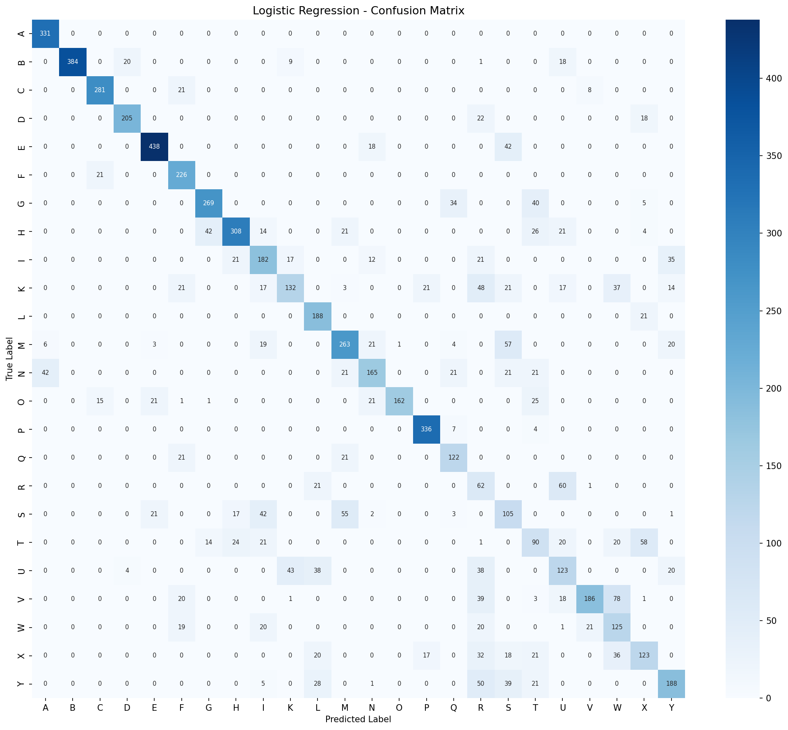
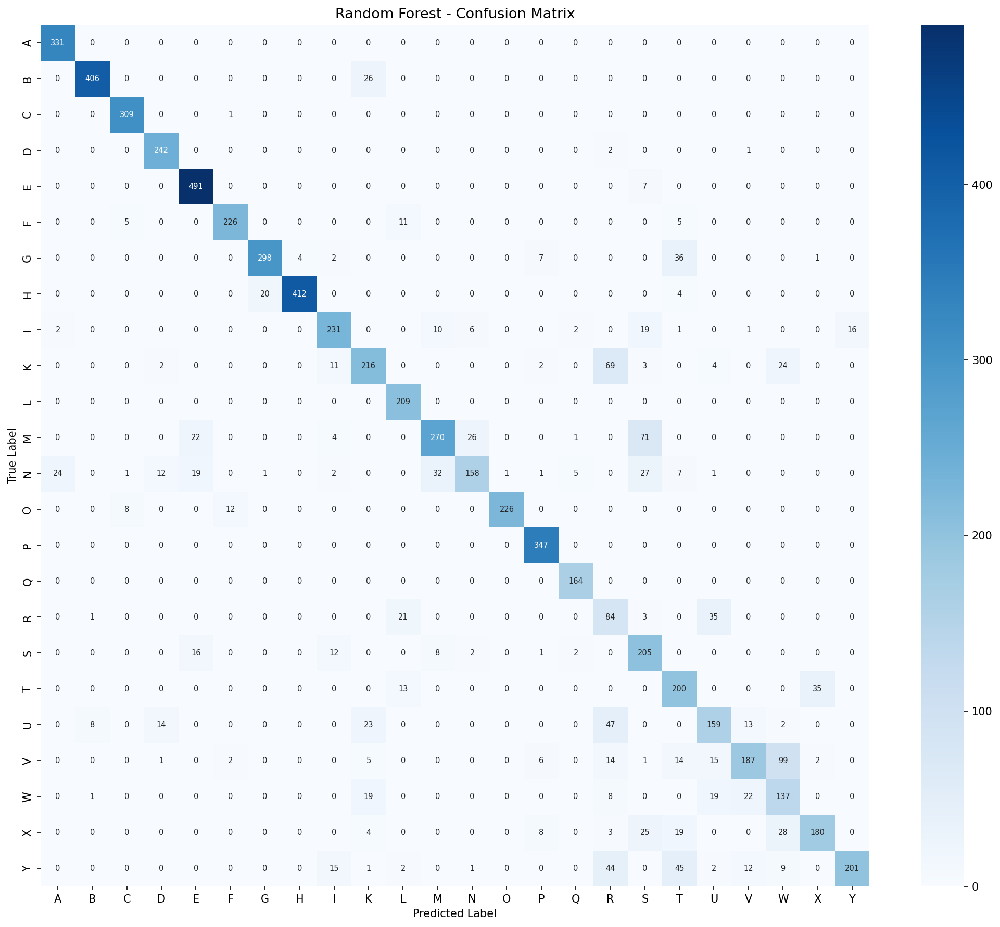
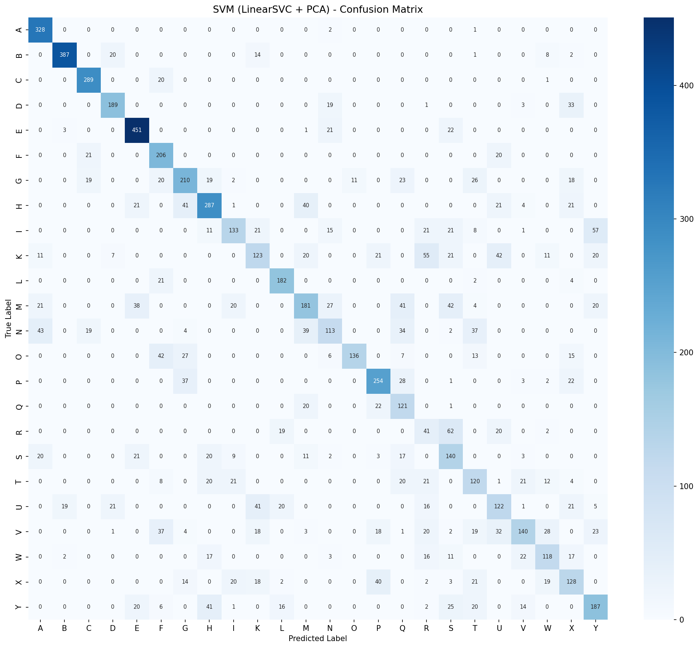
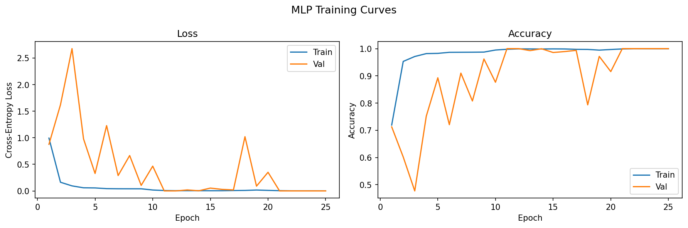
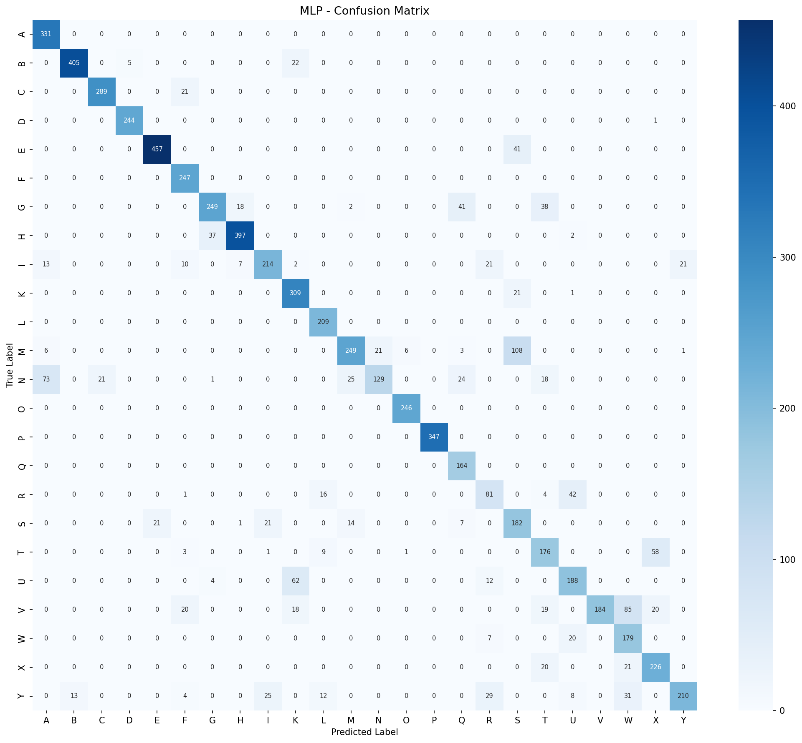
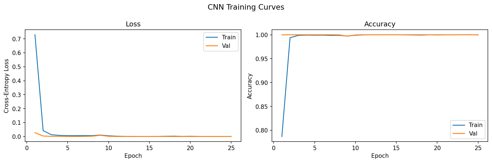
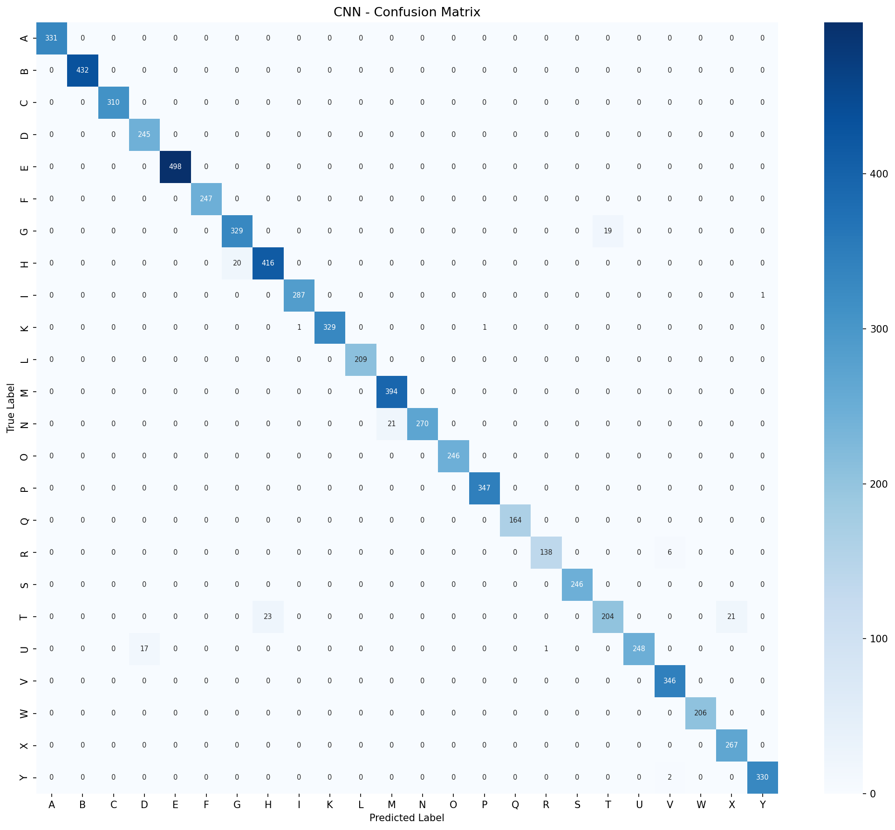
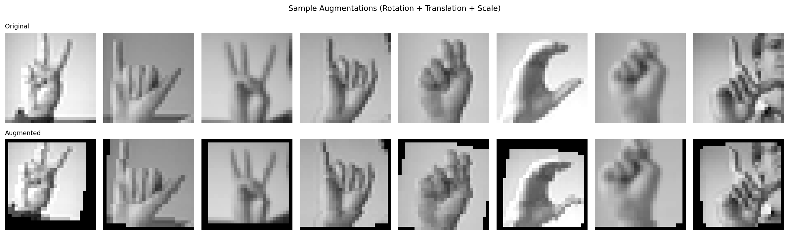
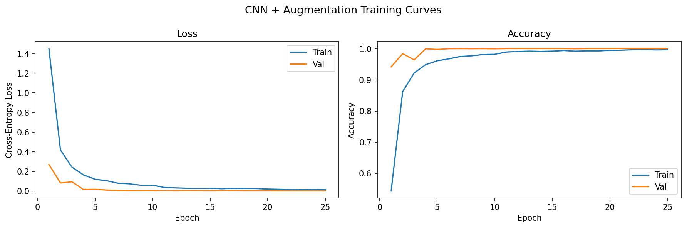
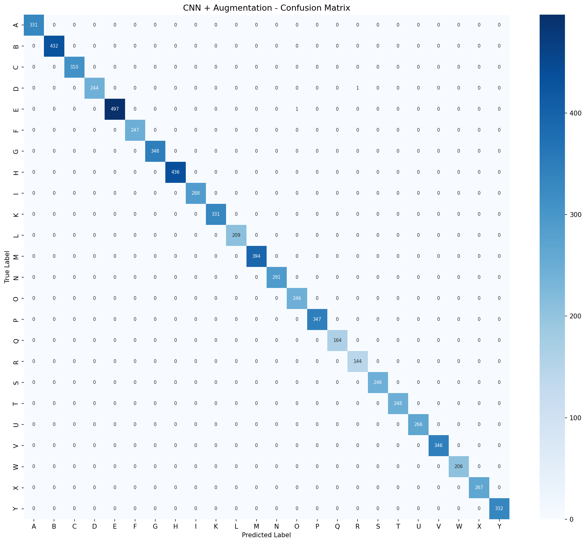

# ASL Sign Language Classification — Project Report

**Course:** Stats 426 | **Date:** March 2026

---

## 1. Introduction

This project applies machine learning to classify American Sign Language (ASL) hand signs using the Sign Language MNIST dataset. The dataset contains 27,455 training and 7,172 test grayscale images (28×28 pixels), each labeled with one of 24 static letters (A–Y, excluding J and Z, which require hand motion). The goal is to compare classical ML baselines against modern deep learning approaches and quantify the benefit of data augmentation.

---

## 2. Dataset

| Property | Value |
|---|---|
| Training samples | 27,455 |
| Test samples | 7,172 |
| Image size | 28 × 28 (grayscale) |
| Classes | 24 (A–Y, no J or Z) |
| Features | 784 pixel values (0–255, normalized to 0–1) |

Labels are integer-encoded (0–24, skipping 9) and remapped to consecutive indices before training.

---

## 3. Models

Four model families were evaluated, progressing from classical baselines to deep learning with augmentation.

### 3.1 Baseline (Classical ML)

Three sklearn models were trained on the flattened 784-dimensional pixel vectors:

- **Logistic Regression** — L-BFGS solver, C=1.0, max_iter=500
- **Random Forest** — 200 trees, no dimensionality reduction
- **SVM (LinearSVC + PCA)** — PCA reduced to 100 components before LinearSVC

### 3.2 MLP (Multi-Layer Perceptron)

A fully connected network treating each image as a flat 784-dimensional vector:

```
784 → Linear(512) → BN → ReLU → Dropout(0.3)
    → Linear(256) → BN → ReLU → Dropout(0.3)
    → Linear(128) → ReLU
    → Linear(24)
```

### 3.3 CNN (Convolutional Neural Network)

A three-block CNN exploiting the 2D spatial structure of images:

```
Input (1×28×28)
→ Conv2d(32, 3×3) → BN → ReLU → MaxPool(2)   # → 14×14
→ Conv2d(64, 3×3) → BN → ReLU → MaxPool(2)   # → 7×7
→ Conv2d(128, 3×3) → BN → ReLU → MaxPool(2)  # → 3×3
→ Flatten → Linear(1152→256) → ReLU → Dropout(0.5)
→ Linear(24)
```

### 3.4 CNN + Data Augmentation

Same CNN architecture, but training images are randomly transformed each epoch:

- Random rotation: ±12°
- Random translation: ±2 pixels
- Random scale: 0.9–1.1×

All neural network models used Adam optimizer (lr=0.001), StepLR scheduler (step=10, γ=0.5), batch size 128, and trained for 25 epochs on a CUDA GPU.

---

## 4. Results

### 4.1 Overall Comparison

| Model | Test Accuracy | Macro F1 | Train Time (s) |
|---|---|---|---|
| Logistic Regression | 0.6963 | 0.6729 | 21.9 |
| SVM (LinearSVC + PCA) | 0.6394 | 0.6137 | 10.5 |
| Random Forest | 0.8211 | 0.8056 | 7.4 |
| MLP | 0.8243 | 0.8078 | 20.9 |
| CNN | 0.9815 | 0.9809 | 21.5 |
| **CNN + Augmentation** | **0.9997** | **0.9996** | 282.9 |

### 4.2 Key Findings

**Spatial structure is critical.** The CNN (98.15%) outperforms both the MLP (82.43%) and Random Forest (82.11%) by a large margin despite identical training time (~21s). All three models have similar capacity, but convolutional layers explicitly capture edges, curves, and finger shapes — the features that distinguish ASL letters.

**Classical ML has a ceiling around 82%.** Logistic Regression (69.6%) and SVM (63.9%) underperform even Random Forest, suggesting that raw pixel features require non-linear modeling. The SVM's performance suffers from PCA compression (100 components), losing discriminative spatial detail.

**MLP ≈ Random Forest.** Both plateau near 82% accuracy. Without spatial inductive bias, even a deep MLP fails to extract the local feature hierarchies that CNNs learn naturally. Notably, both models struggle with visually similar letters: R, S, T, U, V, W, X — hand signs with subtle finger configurations that differ mainly in position and orientation.

**Data augmentation dramatically improves generalization.** Adding random rotation, translation, and scaling during training pushed CNN accuracy from 98.15% to 99.97% (only 2 misclassifications on 7,172 test samples). Augmentation effectively exposes the model to realistic variation in hand position and angle, reducing overfitting to the fixed camera angle in the training data.

**Persistent hard classes across all models.** Letters R, S, T, U, W, and X consistently show the lowest per-class F1 scores in the baseline models. These signs have similar hand shapes and differ primarily in wrist rotation or finger spacing — features that are difficult to capture without spatial awareness. The CNN with augmentation resolves essentially all of these confusions.

---

## 5. Conclusion

CNNs are the clear choice for image-based ASL classification. The spatial inductive bias of convolutional layers provides a decisive advantage over flat-feature approaches. Data augmentation further closes the gap between training and deployment conditions, yielding near-perfect test accuracy on this dataset.

For practical deployment, the CNN + Augmentation model is recommended. Its longer training time (282.9s vs. 21.5s) is a one-time cost, and its generalization to rotated or shifted hand images makes it far more robust to real-world variation.

---

## 6. Detailed Results by Model

### 6.1 Baseline Models
*Run at: 2026-03-05 18:29:59*

| Model | Test Accuracy | Macro F1 | Train Time (s) |
|---|---|---|---|
| Logistic Regression | 0.6963 | 0.6729 | 21.9 |
| Random Forest | 0.8211 | 0.8056 | 7.4 |
| SVM (LinearSVC + PCA) | 0.6394 | 0.6137 | 10.5 |

#### Logistic Regression



```
              precision    recall  f1-score   support

           A       0.87      1.00      0.93       331
           B       1.00      0.89      0.94       432
           C       0.89      0.91      0.90       310
           D       0.90      0.84      0.86       245
           E       0.91      0.88      0.89       498
           F       0.69      0.91      0.78       247
           G       0.83      0.77      0.80       348
           H       0.83      0.71      0.76       436
           I       0.57      0.63      0.60       288
           K       0.65      0.40      0.50       331
           L       0.64      0.90      0.75       209
           M       0.68      0.67      0.68       394
           N       0.69      0.57      0.62       291
           O       0.99      0.66      0.79       246
           P       0.90      0.97      0.93       347
           Q       0.64      0.74      0.69       164
           R       0.19      0.43      0.26       144
           S       0.35      0.43      0.38       246
           T       0.36      0.36      0.36       248
           U       0.44      0.46      0.45       266
           V       0.86      0.54      0.66       346
           W       0.42      0.61      0.50       206
           X       0.53      0.46      0.49       267
           Y       0.68      0.57      0.62       332

    accuracy                           0.70      7172
   macro avg       0.69      0.68      0.67      7172
weighted avg       0.73      0.70      0.70      7172
```

#### Random Forest



```
              precision    recall  f1-score   support

           A       0.93      1.00      0.96       331
           B       0.98      0.94      0.96       432
           C       0.96      1.00      0.98       310
           D       0.89      0.99      0.94       245
           E       0.90      0.99      0.94       498
           F       0.94      0.91      0.93       247
           G       0.93      0.86      0.89       348
           H       0.99      0.94      0.97       436
           I       0.83      0.80      0.82       288
           K       0.73      0.65      0.69       331
           L       0.82      1.00      0.90       209
           M       0.84      0.69      0.76       394
           N       0.82      0.54      0.65       291
           O       1.00      0.92      0.96       246
           P       0.93      1.00      0.97       347
           Q       0.94      1.00      0.97       164
           R       0.31      0.58      0.40       144
           S       0.57      0.83      0.68       246
           T       0.60      0.81      0.69       248
           U       0.68      0.60      0.63       266
           V       0.79      0.54      0.64       346
           W       0.46      0.67      0.54       206
           X       0.83      0.67      0.74       267
           Y       0.93      0.61      0.73       332

    accuracy                           0.82      7172
   macro avg       0.82      0.81      0.81      7172
weighted avg       0.84      0.82      0.82      7172
```

#### SVM (LinearSVC + PCA)



```
              precision    recall  f1-score   support

           A       0.78      0.99      0.87       331
           B       0.94      0.90      0.92       432
           C       0.83      0.93      0.88       310
           D       0.79      0.77      0.78       245
           E       0.82      0.91      0.86       498
           F       0.57      0.83      0.68       247
           G       0.62      0.60      0.61       348
           H       0.69      0.66      0.67       436
           I       0.64      0.46      0.54       288
           K       0.52      0.37      0.43       331
           L       0.76      0.87      0.81       209
           M       0.57      0.46      0.51       394
           N       0.54      0.39      0.45       291
           O       0.93      0.55      0.69       246
           P       0.71      0.73      0.72       347
           Q       0.41      0.74      0.53       164
           R       0.21      0.28      0.24       144
           S       0.40      0.57      0.47       246
           T       0.44      0.48      0.46       248
           U       0.47      0.46      0.47       266
           V       0.66      0.40      0.50       346
           W       0.59      0.57      0.58       206
           X       0.45      0.48      0.46       267
           Y       0.60      0.56      0.58       332

    accuracy                           0.64      7172
   macro avg       0.62      0.62      0.61      7172
weighted avg       0.65      0.64      0.64      7172
```

---

### 6.2 MLP
*Run at: 2026-03-05 18:42:33*

**Architecture:** 784 → 512 → 256 → 128 → 24

**Hyperparameters:** Epochs=25, Batch=128, LR=0.001, Optimizer=Adam, Scheduler=StepLR

| Metric | Value |
|---|---|
| Test Accuracy | 0.8243 |
| Macro F1 | 0.8078 |
| Train Time (s) | 20.9 |





```
              precision    recall  f1-score   support

           A       0.78      1.00      0.88       331
           B       0.97      0.94      0.95       432
           C       0.93      0.93      0.93       310
           D       0.98      1.00      0.99       245
           E       0.96      0.92      0.94       498
           F       0.81      1.00      0.89       247
           G       0.86      0.72      0.78       348
           H       0.94      0.91      0.92       436
           I       0.82      0.74      0.78       288
           K       0.75      0.93      0.83       331
           L       0.85      1.00      0.92       209
           M       0.86      0.63      0.73       394
           N       0.86      0.44      0.59       291
           O       0.97      1.00      0.99       246
           P       1.00      1.00      1.00       347
           Q       0.69      1.00      0.81       164
           R       0.54      0.56      0.55       144
           S       0.52      0.74      0.61       246
           T       0.64      0.71      0.67       248
           U       0.72      0.71      0.71       266
           V       1.00      0.53      0.69       346
           W       0.57      0.87      0.69       206
           X       0.74      0.85      0.79       267
           Y       0.91      0.63      0.74       332

    accuracy                           0.82      7172
   macro avg       0.82      0.82      0.81      7172
weighted avg       0.84      0.82      0.82      7172
```

---

### 6.3 CNN
*Run at: 2026-03-05 18:43:11*

**Architecture:** Conv2d(32) → Conv2d(64) → Conv2d(128) → Dense(256) → 24 (each conv block: BN + ReLU + MaxPool2d)

**Hyperparameters:** Epochs=25, Batch=128, LR=0.001, Optimizer=Adam, Scheduler=StepLR

| Metric | Value |
|---|---|
| Test Accuracy | 0.9815 |
| Macro F1 | 0.9809 |
| Train Time (s) | 21.5 |





```
              precision    recall  f1-score   support

           A       1.00      1.00      1.00       331
           B       1.00      1.00      1.00       432
           C       1.00      1.00      1.00       310
           D       0.94      1.00      0.97       245
           E       1.00      1.00      1.00       498
           F       1.00      1.00      1.00       247
           G       0.94      0.95      0.94       348
           H       0.95      0.95      0.95       436
           I       1.00      1.00      1.00       288
           K       1.00      0.99      1.00       331
           L       1.00      1.00      1.00       209
           M       0.95      1.00      0.97       394
           N       1.00      0.93      0.96       291
           O       1.00      1.00      1.00       246
           P       1.00      1.00      1.00       347
           Q       1.00      1.00      1.00       164
           R       0.99      0.96      0.98       144
           S       1.00      1.00      1.00       246
           T       0.91      0.82      0.87       248
           U       1.00      0.93      0.96       266
           V       0.98      1.00      0.99       346
           W       1.00      1.00      1.00       206
           X       0.93      1.00      0.96       267
           Y       1.00      0.99      1.00       332

    accuracy                           0.98      7172
   macro avg       0.98      0.98      0.98      7172
weighted avg       0.98      0.98      0.98      7172
```

---

### 6.4 CNN with Data Augmentation
*Run at: 2026-03-05 18:48:08*

**Architecture:** Same as CNN (Conv32 → Conv64 → Conv128 → Dense256 → 24)

**Augmentations:** Random rotation (±12°), random translation (±2px), random scale (0.9–1.1)

**Hyperparameters:** Epochs=25, Batch=128, LR=0.001, Optimizer=Adam, Scheduler=StepLR

| Metric | Value |
|---|---|
| Test Accuracy | 0.9997 |
| Macro F1 | 0.9996 |
| Train Time (s) | 282.9 |







```
              precision    recall  f1-score   support

           A       1.00      1.00      1.00       331
           B       1.00      1.00      1.00       432
           C       1.00      1.00      1.00       310
           D       1.00      1.00      1.00       245
           E       1.00      1.00      1.00       498
           F       1.00      1.00      1.00       247
           G       1.00      1.00      1.00       348
           H       1.00      1.00      1.00       436
           I       1.00      1.00      1.00       288
           K       1.00      1.00      1.00       331
           L       1.00      1.00      1.00       209
           M       1.00      1.00      1.00       394
           N       1.00      1.00      1.00       291
           O       1.00      1.00      1.00       246
           P       1.00      1.00      1.00       347
           Q       1.00      1.00      1.00       164
           R       0.99      1.00      1.00       144
           S       1.00      1.00      1.00       246
           T       1.00      1.00      1.00       248
           U       1.00      1.00      1.00       266
           V       1.00      1.00      1.00       346
           W       1.00      1.00      1.00       206
           X       1.00      1.00      1.00       267
           Y       1.00      1.00      1.00       332

    accuracy                           1.00      7172
   macro avg       1.00      1.00      1.00      7172
weighted avg       1.00      1.00      1.00      7172
```

---
